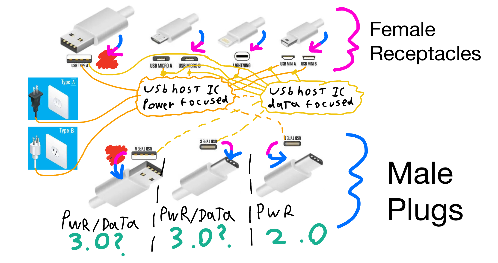
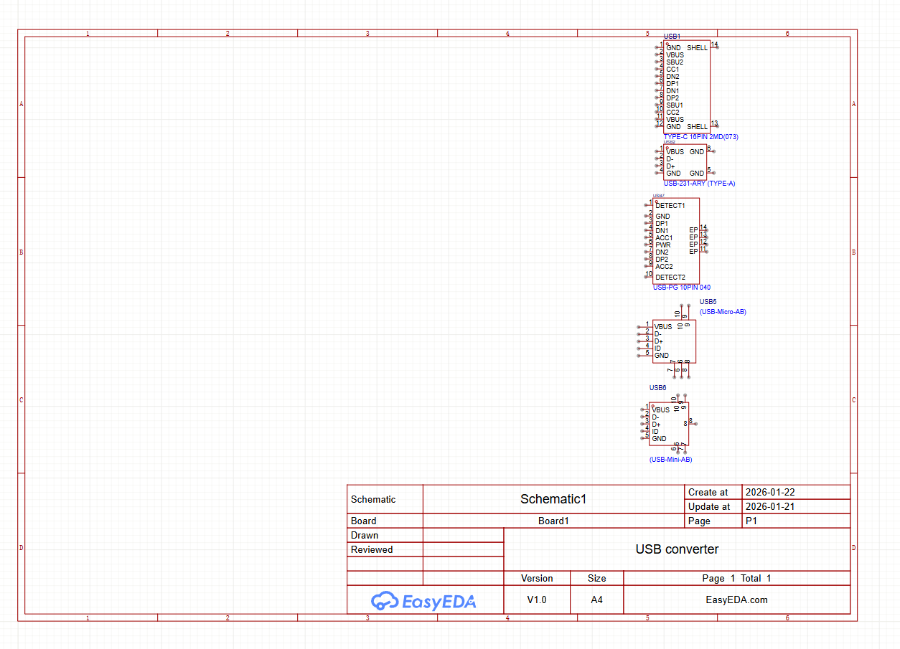
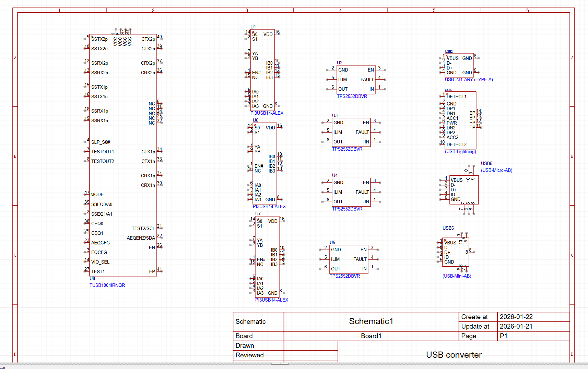
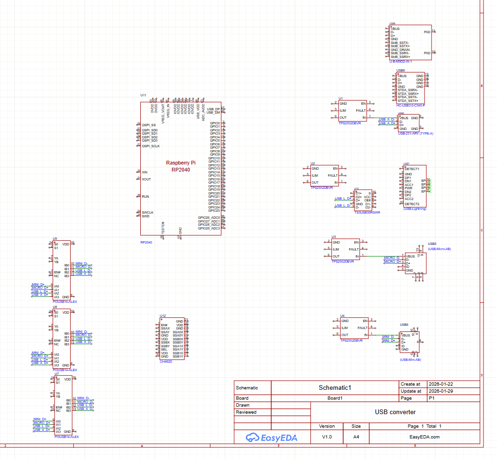
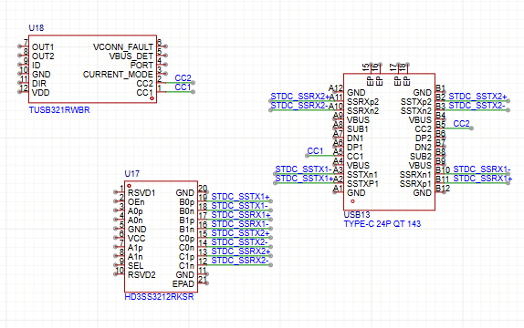

# May 28: Concept Stuff

This image is what i imagine the final product looking like but since i am going into this COMPLETELY blind (i had to search up what USB meant), its probably going to look a lot different. But it's the thought that counts, right?

After this i will try to find all the components of the USB's and then based on all of the inputs find a USB Host Controller IC.

**Total time spent: 1 hour**

# May 28: Chose USB Receptacle Parts for Schematic

Finally caved and decided to use EasyEDA instead of Kicad as per a friends suggestion. finding all of the receptacles was difficult but not impossible as it had been on Kicad. To conclude, i found all the receptacles and it was a pleasant surprise that there were AB versions of some USB's which saved a ton of time. I am now going to search for the plugs and then the USB Host controller IC's.

**Total time spent: 2 hours**

# May 29: Worked on Schematic

Picked out a few more switch and power IC's and a superspeed one. though, i haven't been able to find any USB plugs and i'm still deciding on my MCU as it will be crucial to this project.

**Total time spent: 3 hours**

# May 29: Changed up schematic + wired a bit

I haven't found the output symbols yet but i will soon. I have also chosen to go with a few more USB 3.0 inputs to convert since i wanted to dip my toes into 3.0 superspeed territory and to add a bit more functionality to the design

i have no idea how to handle phone charging from all of those USB's and have yet to find any suitable phone power management IC's, let alone USB power ones, but its probably not that hard to figure out.

**Total time spent: 2 hours**

# May 29: Changed up schematic + wired a bit

Because of their excellently documented datasheets, I went with a TI chip for both the CC controller and the USB-C SS multiplexing.

It was quite difficult to wire all of the SS lines as i was confused on where TX/RX goes and it didn't help that the USB-C receptacle datasheet had barely any pinout info, but i managed in the end.

I am now looking into whether i want usb-PD and some QSPI flash memory for the RP2040 that i will use in this design.

**Total time spent: 1.5 hours**

